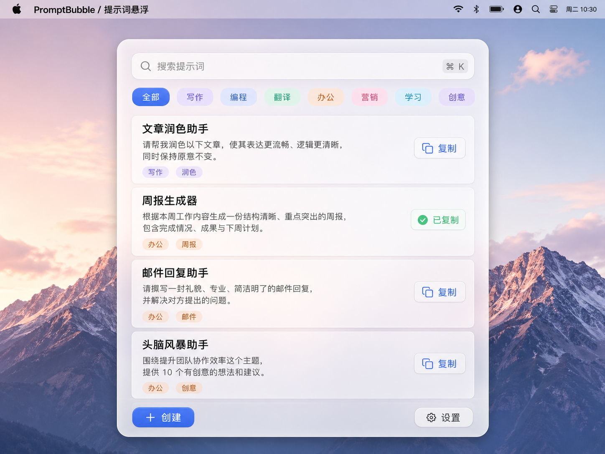
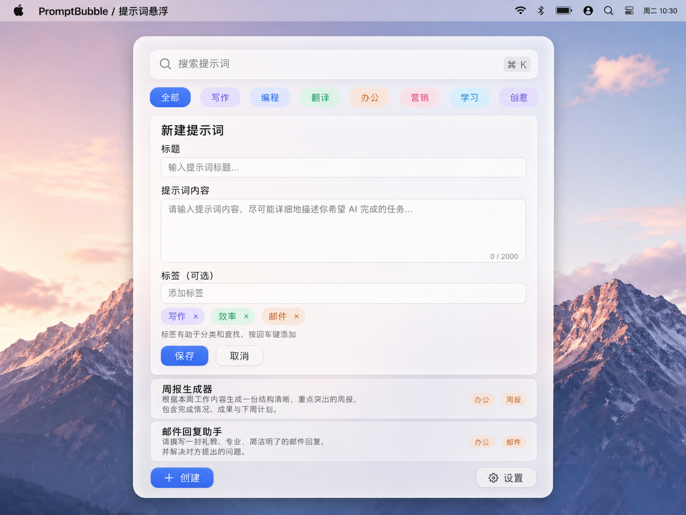

# Bubble

> macOS 菜单栏提示词管理器 — 磨砂玻璃面板，全局快捷键，一键复制


---

## 简介

Bubble 是一款 macOS 菜单栏应用。点击状态栏图标或按下全局快捷键，即可唤出磨砂玻璃风格浮窗，快速搜索、编辑、复制你积累的提示词库。

**核心理念：** 不打断当前工作流，随取随用，用完即走。

<p align="center">
  
  &nbsp;&nbsp;
  
</p>

---

## 功能特性

| 功能 | 说明 |
|------|------|
| 菜单栏常驻 | 无 Dock 图标，不占桌面空间 |
| 全局快捷键 | 任意应用中唤起面板（默认 `Cmd+Shift+Space`，可自定义） |
| 磨砂玻璃 UI | 原生 `NSVisualEffectView`，与 macOS 系统风格一致 |
| 搜索 + 标签筛选 | 同时搜索标题与内容，支持自定义分类标签 |
| 一键复制 | 复制后可立即在其他应用粘贴 |
| 本地数据存储 | 基于 SwiftData，数据只在本机，不联网 |
| 开机自启动 | 使用 `SMAppService`，系统级原生支持 |

---

## 系统要求

- macOS 14.0 (Sonoma) 或更新版本
- Xcode 15.0+（从源码编译时需要）

---

## 安装

### 方式一：下载现成应用

1. 前往 [Releases](https://github.com/pengchonglin6-sketch/Bubble/releases) 下载最新的 `Bubble.app.zip`
2. 解压后把 `Bubble.app` 拖入「应用程序」文件夹
3. **首次打开**：应用未经 Apple 公证，直接双击会被拦截。请**右键点击 Bubble.app → 打开 → 再点「打开」**；或在终端执行：

   ```bash
   xattr -dr com.apple.quarantine /Applications/Bubble.app
   ```

### 方式二：从源码编译

```bash
# 1. 克隆仓库
git clone https://github.com/pengchonglin6-sketch/Bubble.git
cd Bubble

# 2. 用 Xcode 打开
open Bubble/Bubble.xcodeproj

# 3. Cmd+B 编译，Cmd+R 运行
```

首次运行时系统会申请**辅助功能**权限（全局快捷键必需）：
`系统设置 → 隐私与安全性 → 辅助功能 → 打开 Bubble 开关`

---

## 使用指南

### 打开面板

- 点击菜单栏的气泡图标
- 或在任意应用中按 `Cmd+Shift+Space`

### 管理提示词

| 操作 | 步骤 |
|------|------|
| 搜索 | 在搜索框输入关键词（搜索标题 + 内容） |
| 筛选 | 点击顶部标签栏切换分类 |
| 复制 | 点击卡片右侧复制按钮，按钮变 ✓ 表示成功 |
| 新建 | 点击底部 `+ 创建`，填入标题、内容、标签后保存 |
| 编辑 | 点击卡片铅笔图标进入编辑页 |
| 删除 | 在编辑页底部点击删除并确认 |

### 快捷键

| 快捷键 | 动作 |
|--------|------|
| `Cmd + Shift + Space` | 打开 / 关闭面板（全局，可自定义） |
| `Cmd + S` | 保存（在编辑表单中） |
| `Esc` | 关闭面板或返回列表 |

---

## 设置面板

点击底部 `⚙️ 设置` 进入：

- **全局快捷键**：点击输入框，按下新的组合键录制（必须包含修饰键）
- **开机自启动**：开启后 Mac 重启时 Bubble 自动运行
- **显示菜单栏图标**：关闭后图标隐藏，但快捷键仍可唤起面板

---

## 数据存储

所有提示词数据**只保存在本地**，使用 SwiftData（Apple 原生 ORM）。

数据库位置：`~/Library/Application Support/Bubble/`，可手动备份。

---

## 故障排查

**全局快捷键无响应**
→ 前往 `系统设置 → 隐私与安全性 → 辅助功能`，确认 Bubble 已打开

**修改快捷键后未生效**
→ 新快捷键与其他应用冲突，在设置中查看提示并更换组合键

**开机启动未工作**
→ 在设置中关闭再重新开启"开机自启动"

**提示"无法打开，因为来自身份不明的开发者"**
→ 见上方「安装 · 方式一」第 3 步

---

## 技术栈

| 层级 | 技术 |
|------|------|
| UI 框架 | SwiftUI + AppKit |
| 数据持久化 | SwiftData |
| 全局快捷键 | HotKey (SPM) |
| 开机启动 | SMAppService |
| 剪贴板 | NSPasteboard |
| 最低系统 | macOS 14.0 |

---

## 项目结构

```
Bubble/              # Xcode 项目
├── Bubble.xcodeproj
├── Bubble/          # 源码（App 入口 / Models / Views / Services / Helpers）
├── BubbleTests/     # 单元测试
└── tasks/           # 开发计划文档
UI/                  # 设计原型图
```

---

## License

[MIT](LICENSE)
