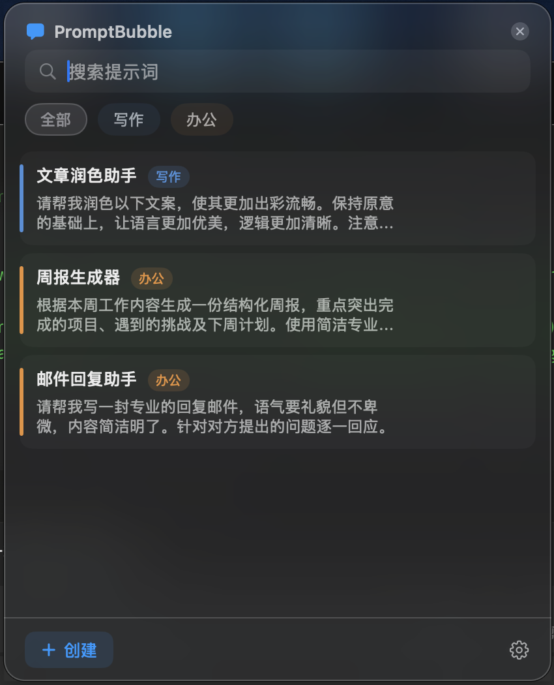
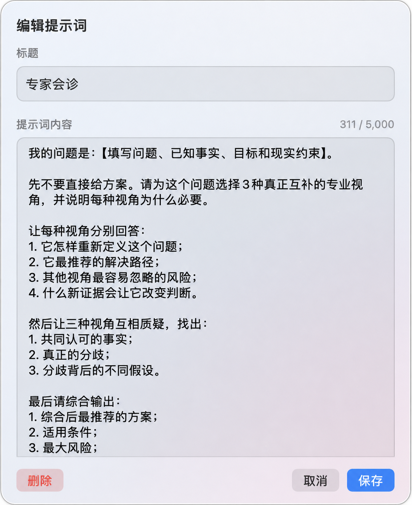

# Bubble

> macOS 菜单栏提示词管理器 — 可移动吸附面板、即时卡片排序、全局快捷键、一键复制


---

## 简介

Bubble 是一款 macOS 菜单栏应用。点击状态栏图标或按下全局快捷键，即可唤出实色玻璃风格浮窗，快速搜索、排序、编辑和复制你积累的提示词库。面板默认出现在当前屏幕右上方，也可以拖到任意位置，并在靠近可用屏幕边缘时轻微吸附。

**核心理念：** 不打断当前工作流，随取随用，用完即走。

<p align="center">
  
  &nbsp;&nbsp;
  
</p>

---

## 功能特性

| 功能 | 说明 |
|------|------|
| 菜单栏常驻 | 无 Dock 图标，不占桌面空间 |
| 全局快捷键 | 任意应用中唤起面板（默认 `Cmd+Shift+Space`，可自定义） |
| 实色玻璃 UI | 柔和渐变与高光颗粒，不透出后方内容，拖动时更清晰 |
| 可移动与轻吸附 | 从标题栏拖动整个面板；首次默认位于右上方，靠近屏幕可用边缘时轻微吸附，不遮挡菜单栏或 Dock |
| 卡片拖动排序 | 按住卡片并移动约 3pt 即可排序；拖动时缩小至 80%，卡片间显示蓝色插入线 |
| 边缘自动滚动 | 拖动到卡片区域顶部或底部时自动滚动，方便移动长列表末尾的卡片 |
| 搜索 + 标签筛选 | 同时搜索标题与内容，支持自定义分类标签 |
| 一键复制 | 复制按钮会给出对勾反馈，随后收起面板，可立即在其他应用粘贴 |
| 提示词管理 | 支持创建、编辑、确认删除；单条提示词内容上限为 5000 个字符 |
| 本地数据存储 | 基于 SwiftData，数据只在本机，不联网 |
| 开机自启动 | 使用 `SMAppService`，系统级原生支持 |

---

## 系统要求

- macOS 14.0 (Sonoma) 或更新版本
- Xcode 15.0+（从源码编译时需要）

---

## 安装

### 方式一：下载现成应用

1. 前往 [Releases](https://github.com/pengchonglin6-sketch/Bubble/releases) 下载最新的 `Bubble.app.zip`
2. 解压后把 `Bubble.app` 拖入「应用程序」文件夹
3. **首次打开**：应用未经 Apple 公证，直接双击会被拦截。请**右键点击 Bubble.app → 打开 → 再点「打开」**；或在终端执行：

   ```bash
   xattr -dr com.apple.quarantine /Applications/Bubble.app
   ```

### 方式二：从源码编译

```bash
# 1. 克隆仓库
git clone https://github.com/pengchonglin6-sketch/Bubble.git
cd Bubble

# 2. 用 Xcode 打开
open Bubble/Bubble.xcodeproj

# 3. Cmd+B 编译，Cmd+R 运行
```

---

## 使用指南

### 打开面板

- 点击菜单栏的气泡图标
- 或在任意应用中按 `Cmd+Shift+Space`

### 管理提示词

| 操作 | 步骤 |
|------|------|
| 搜索 | 在搜索框输入关键词（搜索标题 + 内容） |
| 筛选 | 点击顶部标签栏切换分类 |
| 复制 | 点击卡片右侧复制按钮，按钮变 ✓ 表示成功 |
| 新建 | 点击底部 `+ 创建`，填入标题、内容、标签后保存 |
| 编辑 | 点击卡片铅笔图标进入编辑页 |
| 删除 | 点击卡片右侧垃圾桶，或在编辑页底部点击删除，然后确认 |
| 排序 | 按住卡片并直接拖动；蓝色横线表示松手后的插入位置 |
| 长列表排序 | 拖动卡片到列表区域顶部或底部，列表会连续自动滚动 |

### 移动面板

- 按住顶部标题区域即可拖动整个面板，卡片区域仍专门用于卡片排序
- 第一次打开时，面板默认出现在当前屏幕右上方
- 靠近屏幕左、右、上、下可用边缘时会产生轻微吸附
- 顶部吸附边界位于菜单栏下方，底部边界会避开 Dock

### 快捷键

| 快捷键 | 动作 |
|--------|------|
| `Cmd + Shift + Space` | 打开 / 关闭面板（全局，可自定义） |
| `Return` | 创建或保存（表单内容有效时） |
| `Esc` | 取消当前表单并返回列表 |

---

## 设置面板

点击底部 `⚙️ 设置` 进入：

- **全局快捷键**：点击输入框，按下新的组合键录制（必须包含修饰键）
- **开机自启动**：开启后 Mac 重启时 Bubble 自动运行
- **显示菜单栏图标**：关闭后图标隐藏，但快捷键仍可唤起面板

---

## 数据存储

所有提示词数据**只保存在本地**，使用 SwiftData（Apple 原生 ORM）。

数据库位置：`~/Library/Application Support/Bubble/`，可手动备份。

---

## 故障排查

**全局快捷键无响应**
→ 检查快捷键是否被其他应用占用；也可以从菜单栏图标打开设置并重新录制

**修改快捷键后未生效**
→ 新快捷键可能与其他应用冲突；当前版本不会自动检测冲突，请重新录制另一组组合键

**开机启动未工作**
→ 在设置中关闭再重新开启"开机自启动"

**卡片拖不动**
→ 从卡片正文区域按住并移动约 3pt；编辑、复制和删除按钮仍保留各自的点击行为

**排序保存失败**
→ 应用会保留现有提示词并显示错误信息；确认数据库目录可写后重试

**提示"无法打开，因为来自身份不明的开发者"**
→ 见上方「安装 · 方式一」第 3 步

---

## 技术栈

| 层级 | 技术 |
|------|------|
| UI 框架 | SwiftUI + AppKit（自定义 `NSPanel`） |
| 数据持久化 | SwiftData |
| 全局快捷键 | HotKey (SPM) |
| 开机启动 | SMAppService |
| 剪贴板 | NSPasteboard |
| 最低系统 | macOS 14.0 |

---

## 项目结构

```
Bubble/              # Xcode 项目
├── Bubble.xcodeproj
├── Bubble/          # 源码（App 入口 / Models / Views / Services / Helpers）
├── BubbleTests/     # 单元测试
└── tasks/           # 开发计划文档
UI/                  # 设计原型图
assets/              # README 使用的最新版真实界面截图
```

---

## License

[MIT](LICENSE)
